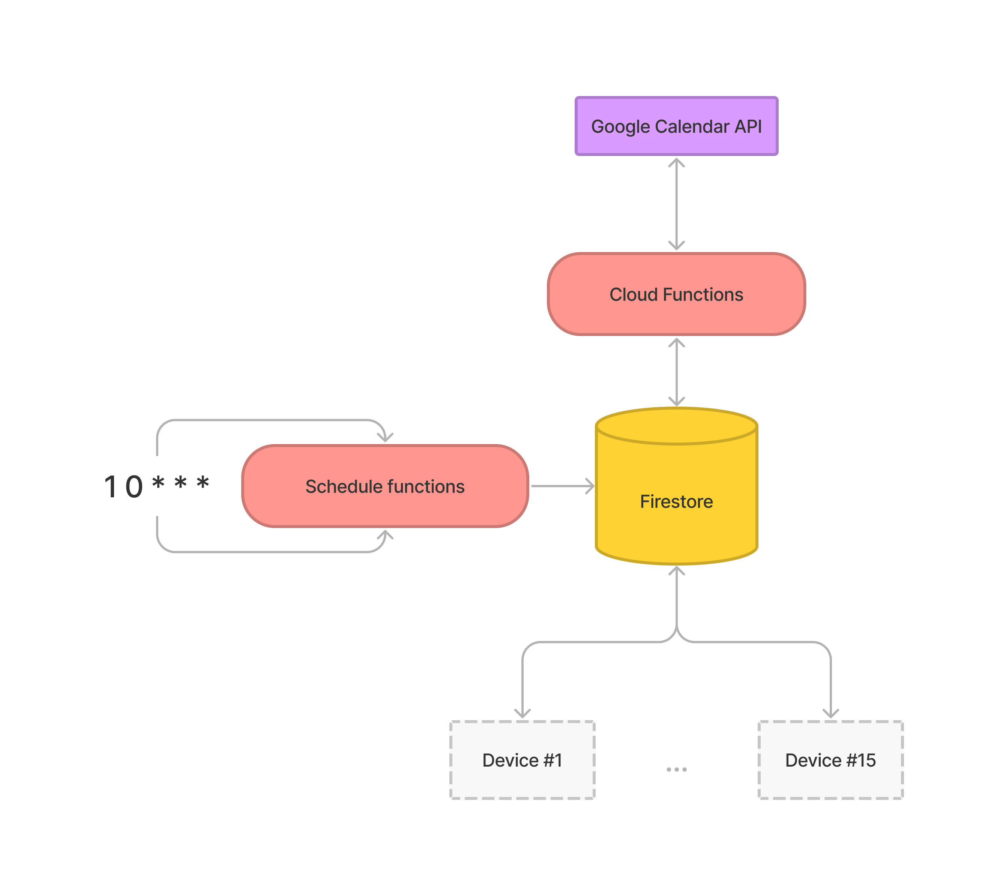

# Chamberlain


> This project is in the open-sourcing process. There is only a mobile application available right now. The Firebase project will be available as soon as possible.

Merixstudio’s IoT meeting room booking system. Chamberlain is a part of our internal [Ginny](https://www.merixstudio.com/work/ginny) application for booking hot desks, conference rooms, and parking spots. If you want more about this project, check out our [blog post](https://content.merixstudio.com/insights/chamberlain-merixstudios-iot-meeting-room-booking).

## Getting started
Right now we're sharing only the client application of the Chamberlain system, so you will not be able to integrate the application with your calendar without additional work. We'll open source the calendar integration as soon as possible.

### Build the Flutter app

1. Generate required files via build_runner, you can run `make run_build_runner` command.

2. Connect Firebase projects by generating Firebase configurations via [Flutter Fire CLI](https://firebase.google.com/docs/flutter/setup?platform=android). At the moment, there is no support for different flavors, so we have to generate configuration multiple times (depending on the number of flavors). Run flutterfire configuration for a specific flavor (prod in this example).
```
flutterfire configure -a com.merixstudio.chamberlain -i com.merixstudio.chamberlain -o lib/config/firebase/options/prod/firebase_options.dart
```

Copy generated `android/google-services.json` to a flavor directory `android/app/prod/google-services.json`

Repeat the process for other flavors.

3. Set the required `--dart-define` envs `CALENDAR_ID`, `PIN_CODE` & `TIMZONE`. VSC launch configuration is available in the `.vscode/launch.json` file.


### Envs
- `FLAVOR` [required] - allows to load different configurations for the firebase project,
- `CALENDAR_ID` [required] - Google Calendar id that is available in the calendar settings,
- `INTERACTION_COUNTER_DISABLED` - allows to disable auto return to the status page,
- `PIN_CODE` - set the pin code for the admin section,
- `TIMZONE` - default timezone for calendar events,
- `EMULATOR_ENABLED`- enables firebase emulator support,
- `EMULATOR_HOST` - defines firebase emulator host address,

## Architecture
The core components of the architecture:
- BloC for state management
- get_it + injectable for DI
- auto_route for routing
- as always: freezed ❤️

The general concept of the application is really simple. Each device communicates with the Firestore only to have real-time communication and offline support. Devices have two main tasks: They listen for events for a specific conference room and create new events. Cloud functions are responsible for listening for changes in events and creating or modifying them on the Google Calendar via the [REST API](https://developers.google.com/calendar/api/v3/reference). Firestore stores the events of the two following days. After midnight, the Cloud Functions Schedulerclears the database and fetch the next two days.

The Google Calendar [watch mechanism](https://developers.google.com/calendar/api/v3/reference/events/watch) is used to stay up-to-date with all events. It allows you to watch a specific calendar ID.




## Kiosk mode
Application is ready to run in kiosk mode. It's a mode that restricts the tablets’ functionality to Chamberlain application only. [Device owner](https://source.android.com/docs/devices/admin/testing-setup#set_up_the_device_owner_for_testing) was set by the ADB. 
In the admin section, the kiosk mode can be disabled. To enter the admin section, double tap on the room name.

## Device
Our goal was to use some unusual devices, so we decided to run Android OS on the RPI 4B. With the great work of https://konstakang.com we did it with ease. We used LineageOS 19 (Android 12L). Device is controlled by the official Raspberry Pi 7" touchscreen display.


## Device Management
Because of the possibility to control devices via SSH, we decided to build a simple desktop application using Flutter to manage all of our devices. It's a really simple application that has some useful features:
- display list of devices
- show device information (name, IP, screen mirror preview)
- control device (restart the device, turn off the screen, and so on).
- send command to multiple devices
- upload new apk to install an update

```
Application & source code availalbe soon
```

## Firebase
Firebase Cloud Functions were used to synchronize events with the Google Calendar. Firestore for storing events and providing real-time communication with the target devices. The whole logic is a part of Ginny application.

```
Source code availalbe soon
```

## TODO
- [ ] Release firebase project (google calendar integration)
- [ ] Release dedicated desktop application for device managament
- [ ] (Chamberlain) Extend meeting time
- [ ] (Chamberlain) Night mode - turn off screen at night